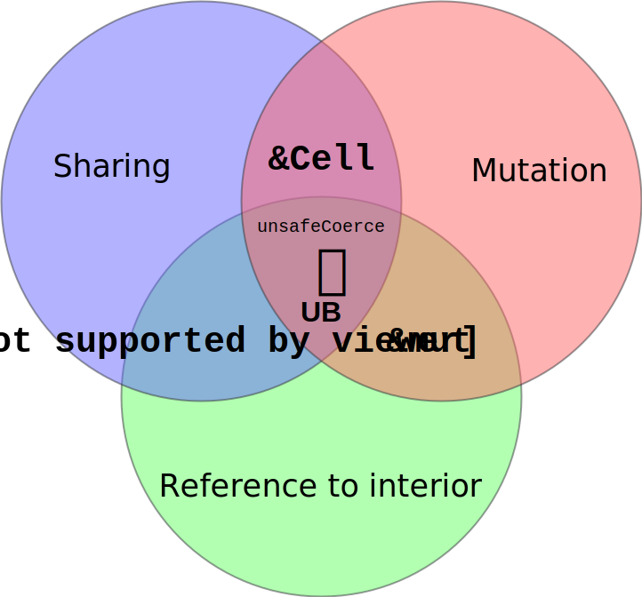

## Expectations, tips, features of a novel programming langauge
(please expand with reasoning)
- dependently typed
Dependent typing seems to bring together various good properties. First, it is the current top level construct that seems useful for representing 'real' computer programs operating on 'real' input data, rather than going into the more mathematical way of building types and proving relations about them. Second, it unifies compile- and runtime programming by making it possible for types to depend on values, at a certain level this means, macros become just ordinary, but well-typeable functions in the system and metaprogramming becomes ordinary programming (e.g. reflection).

- partial evaluation = staging ; binding time inference
Much flexibility and performance could be gained if at any point in a function, where a certain parameter becomes known (or its values are restricted such, that some code dependent on that restriction become dead) the function can be optimized into a specific version conatining less run-time operations.

- prop universe to guarantee type erasure
Some information about types, that are for example boolean judgements (is this type an Integral quantity, is this operation Commutative, etc.) must be validated and decided at compile-time, to maintain performance at runtime and/or signal errors at compile-time.

- whole program compilation
To make a detailed analysis and well supported decisions of rewrites throughout the program, the compiler must have as much information as possible about the problem at hand. Most compilers today trade thoroughness and modularity with compilation speed, with no option to give more time and resources for the compiler to analyze more. There should be a way to do this. Modularity should not stop the flow of useful information across module boundaries.

- aligment ; experimental
- control over memory layout
Layout in memory requires extensive care in context of performance tuning, especially with alignment. When creating parametric functionality, the developer has to have detailed control over how the alignment and padding of different types in composeite types (like elements of a tuple or record). While expliciteness would be too verbose, much of this information should be automatically inferred, or given at the type definition or combined from the environment. Memory layout should be precisely well-defined in all cases, otherwise it would create trouble when sharing structures between devices (like CPU-GPU sharing).

- no GC or optional
The control over the allocated memory should be in the hands of the programmer, because many real world problems are memory limited, and it is a complicated problem dependent task to fit every necessary data into the operational memory, especially, whan parts of it are dynamically re-allocated. Also, the point when GC kicks in could cause unplannable performance hits on runtime, causeing e.g. unexpectedly long frame time, or similar phenomena. 

## Things to discuss
- Indirect access: pointers / references how?
  Only 2 can be chosen of the following three: sharing, mutation, interior pointers] 
  
  

- Scoping, modules, objects
- Pure, impure, semi-pure functions and closures (important example: random number generators and I/O)
- Declarative compiler stage definitions via recursion schemes
- User defined stages / rewrite rules?
- high level vs low level GPU API
  - high level: *accelerate, futhark* ; **automagically works (or not)** (depends on fusion implicitly)
  - low level: *obsidian, [Functional Compute Language](https://github.com/dybber/fcl/blob/master/publications/fhpc2016-fcl.pdf)* ; **explicit user control**
